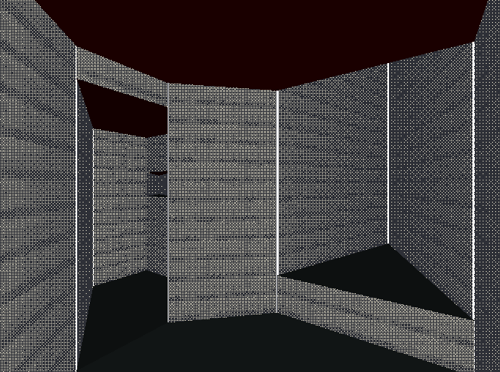

# ObraDoom

A BUILD-style graphics engine. Includes a Lambertian lighting system, a texture mapping system, and a ordered dithering filter.

## Prerequisites

The program uses the [GLFW](https://www.glfw.org/) library.

## Building

`$ make` to create a binary `engine`.

## Usage

 Run `engine` in the directory to start the program. 
- `WASD` are the movement keys. 
- `J` and `K` turns the camera. 
- `Esc` terminates the program.